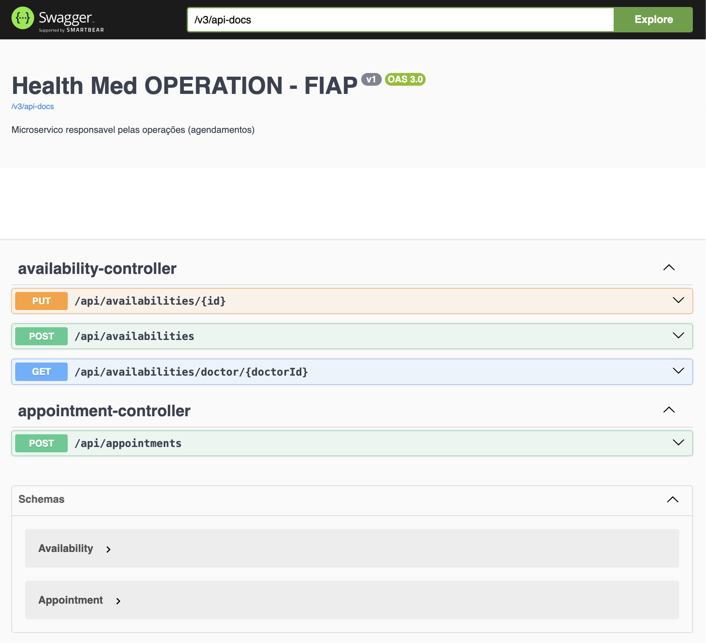

# 🚀 FIAP : Hackathon Pós-Tech Software Architecture
## 🍔 Microserviço health-med-operation

Microserviço responsável pelas operações (agendamentos)

### 👨‍🏫 Grupo

Integrantes:
- Diego S. Silveira (RM352891)
- Wellington Vieira (RM352970)

### 💻 Tecnologias

Tecnologias utilizadas:

* Java 17
* Spring Framework
* Gradle
* MongoDB
* Docker
* Swagger
* Cloud AWS
* Kubernetes

### 👓 Serviços Utilizados

* Github
* Postman
* Docker Desktop
* MongoDB Compass
* k9s
* Minikube
* AWS CLI

### 💿 Swagger

## Version
1.0.0.0